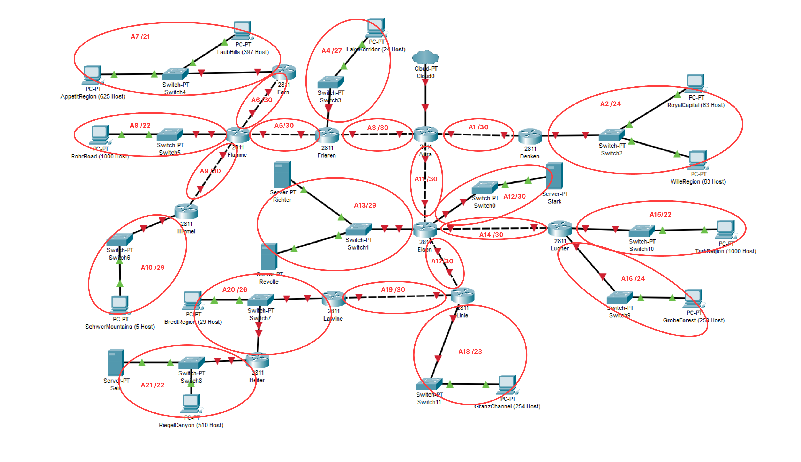
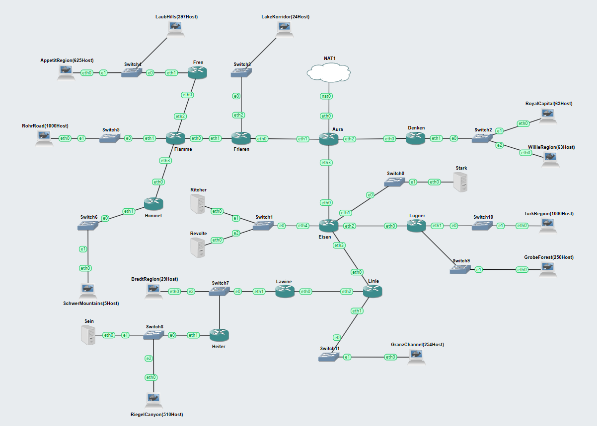
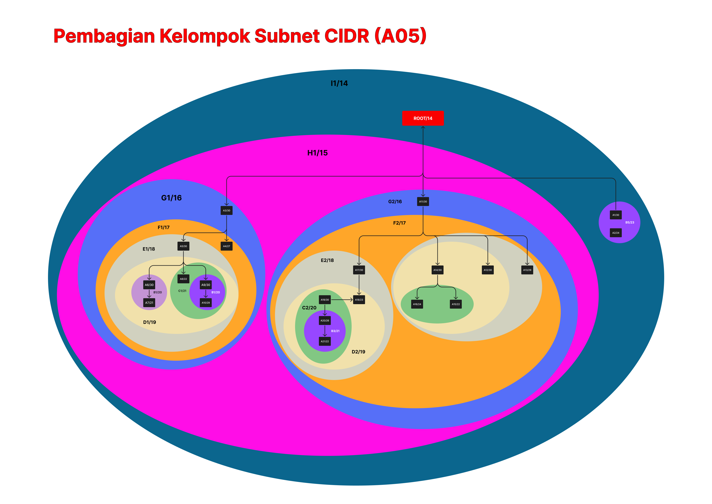
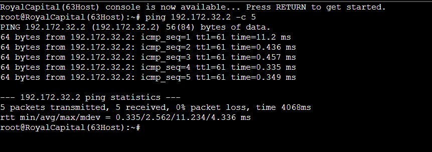
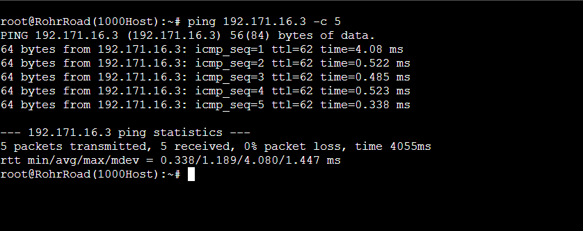
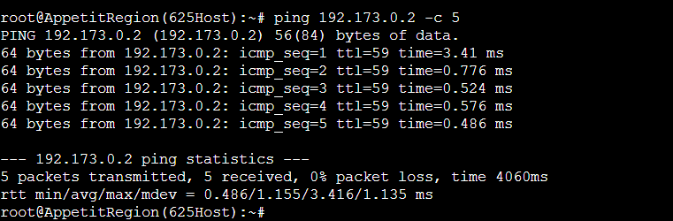
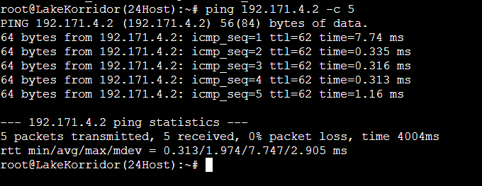

# Jarkom-Modul-4-A05-2023

## Angota

| Nama                 | NRP        |
| -------------------- | ---------- |
| Muhammad Febriansyah | 5025211164 |
| Layyinatul Fuadah    | 5025211207 |

# 1. Subnetting

dilakukan pengelompoka terlebih dahulu untuk mengetahui total ip yang ingin digunakan, dan diperoleh hasil sebagai berikut


| Nama Subnet | Rute                                        | Jumlah IP | Netmask |
| ----------- | ------------------------------------------- | --------- | ------- |
| A1          | Aura-Denken                                 | 2         | /30     |
| A2          | Denken-Switch2-(RoyalCapital - WilleRegion) | 127       | /24     |
| A3          | Aura-Frieren                                | 2         | /30     |
| A4          | Frieren-Switch3-LakeKorridor                | 25        | /27     |
| A5          | Frieren-Flamme                              | 2         | /30     |
| A6          | Flamme-Fern                                 | 2         | /30     |
| A7          | Fern-Switch4-(AppetitRegion - LaubHills)    | 1023      | /21     |
| A8          | Flamme-Switch5-RohrRoad                     | 1001      | /22     |
| A9          | Flamme-Himmel                               | 2         | /30     |
| A10         | Himmel-Switch6-SchwerMountains              | 6         | /29     |
| A11         | Aura-Eisen                                  | 2         | /30     |
| A12         | Eisen-Switch0-Stark                         | 2         | /30     |
| A13         | Eisen-Switch1-Richter&Revolte               | 3         | /29     |
| A14         | Eisen-Lugner                                | 2         | /30     |
| A15         | Lugner-Switch10-TurkRegion                  | 1001      | /22     |
| A16         | Lugner-Switch9-GrobeForest                  | 251       | /24     |
| A17         | Eisen-Linie                                 | 2         | /30     |
| A18         | Linie-Switch11-GranzChannel                 | 255       | /23     |
| A19         | Linie-Lawine                                | 2         | /30     |
| A20         | Lawine-Switch7-BredtRegion&Heiter           | 31        | /26     |
| A21         | Heiter-Switch8-Sein&RiegelCanyon            | 512       | /22     |
| Total       |                                             | 4255      | /19     |

# Soall VLSM dengan menggunakan cisco

## Tree VLSM untuk pembagian IP


## Output

Dari pembuatan tree diatas yang digunakan untuk menentukan IP diperoleh output sebagai berikut:

| Subnet | Network ID    | Netmask         | Broadcast      |
| ------ | ------------- | --------------- | -------------- |
| A1     | 192.171.7.104 | 255.255.255.252 | 192.171.7.107  |
| A2     | 192.171.8.0   | 255.255.255.0   | 192.171.8.255  |
| A3     | 192.171.7.108 | 255.255.255.252 | 192.171.7.111  |
| A4     | 192.171.7.160 | 255.255.255.224 | 192.171.7.191  |
| A5     | 192.171.7.112 | 255.255.255.252 | 192.171.7.115  |
| A6     | 192.171.7.116 | 255.255.255.252 | 192.171.7.119  |
| A7     | 192.171.24.0  | 255.255.248.0   | 192.171.31.255 |
| A8     | 192.171.16.0  | 255.255.252.0   | 192.171.19.255 |
| A9     | 192.171.7.120 | 255.255.255.252 | 192.171.7.123  |
| A10    | 192.171.7.144 | 255.255.255.248 | 192.171.7.151  |
| A11    | 192.171.7.124 | 255.255.255.252 | 192.171.7.127  |
| A12    | 192.171.7.128 | 255.255.255.252 | 192.171.7.131  |
| A13    | 192.171.7.152 | 255.255.255.248 | 192.171.7.159  |
| A14    | 192.171.7.132 | 255.255.255.252 | 192.171.7.135  |
| A15    | 192.171.20.0  | 255.255.252.0   | 192.171.23.255 |
| A16    | 192.171.9.0   | 255.255.255.0   | 192.171.9.255  |
| A17    | 192.171.7.136 | 255.255.255.252 | 192.171.7.139  |
| A18    | 192.171.10.0  | 255.255.254.0   | 192.171.11.255 |
| A19    | 192.171.7.140 | 255.255.255.252 | 192.171.7.143  |
| A20    | 192.171.7.192 | 255.255.255.192 | 192.171.7.255  |
| A21    | 192.171.12.0  | 255.255.252.0   | 192.171.15.255 |

## Konfigurasi IP

### Aura

```sql
ip-kelA1
IPv4 Address  : 192.171.7.105
Subnet Mask   : 255.255.255.252

ip-kelA3
IPv4 Address  : 192.171.7.109
Subnet Mask   : 255.255.255.252

ip-kelA11
IPv4 Address  : 192.171.7.125
Subnet Mask   : 255.255.255.252
```

### Denken

```sql
ip-kelA1
IPv4 Address  : 192.171.7.106
Subnet Mask   : 255.255.255.252
ip-kelA2
IPv4 Address  : 192.171.8.1
Subnet Mask   : 255.255.255.0
```

### WilleRegion

```sql
Default Gateaway  : 192.171.8.1
IPv4 Address      : 192.171.8.65
Subnet Mask       : 255.255.255.0
```

### RoyalCapital

```sql
Default Gateaway  : 192.171.8.1
IPv4 Address      : 192.171.8.2
Subnet Mask       : 255.255.255.0
```

### Frieren

```sql
ip-kelA3
IPv4 Address  : 192.171.7.110
Subnet Mask   : 255.255.255.252

ip-kelA4
IPv4 Address  : 192.171.7.161
Subnet Mask   : 255.255.255.224

ip-kelA5
IPv4 Address  : 192.171.7.113
Subnet Mask   : 255.255.255.252
```

### LakeKorridor

```sql
ip-kelA4
Default Gateaway  : 192.171.7.161
IPv4 Address      : 192.171.7.162
Subnet Mask       : 255.255.255.224
```

### Flamme

```sql
ip-kelA5
IPv4 Address  : 192.171.7.114
Subnet Mask   : 255.255.255.252

ip-kelA6
IPv4 Address  : 192.171.7.117
Subnet Mask   : 255.255.255.252

ip-kelA8
IPv4 Address  : 192.171.16.1
Subnet Mask   : 255.255.252.0

ip-kelA9
IPv4 Address  : 192.171.7.121
Subnet Mask   : 255.255.255.252
```

### Fern

```sql
ip-kelA6
IPv4 Address  : 192.171.7.118
Subnet Mask   : 255.255.255.252

ip-kelA7
IPv4 Address  : 192.171.24.1
Subnet Mask   : 255.255.248.0
```

### LaubHills

```sql
ip-kelA7
Default Gateaway  : 192.171.24.1
IPv4 Address      : 192.171.24.2
Subnet Mask       : 255.255.248.0
```

### AppetitRegion

```sql
ip-kelA7
Default Gateaway  : 192.171.24.1
IPv4 Address      : 192.171.25.143
Subnet Mask       : 255.255.248.0
```

### RohrRoad

```sql
ip-kelA8
Default Gateaway  : 192.171.16.1
IPv4 Address      : 192.171.16.2
Subnet Mask       : 255.255.252.0
```

### Himmel

```sql
ip-kelA9
IPv4 Address  : 192.171.7.122
Subnet Mask   : 255.255.255.252

ip-kelA10
IPv4 Address  : 192.171.7.145
Subnet Mask   : 255.255.255.248

```

### SchwerMountains (A10)

```sql
Default Gateaway  : 192.171.7.145
IPv4 Address      : 192.171.16.2
Subnet Mask       : 255.255.252.0
```

### Eisen

```sql
ip-kelA11
IPv4 Address  : 192.171.7.126
Subnet Mask   : 255.255.255.252

ip-kelA12
IPv4 Address  : 192.171.7.129
Subnet Mask   : 255.255.255.252

ip-kelA13
IPv4 Address  : 192.171.7.153
Subnet Mask   : 255.255.255.248

ip-kelA14
IPv4 Address  : 192.171.7.133
Subnet Mask   : 255.255.255.252

ip-kelA17
IPv4 Address  : 192.171.7.137
Subnet Mask   : 255.255.255.252
```

### Stark

```sql
ip-kelA12
Default Gateaway  : 192.171.7.129
IPv4 Address      : 192.171.7.130
Subnet Mask       : 255.255.255.252
```

### Revolte

```sql
ip-kelA13
Default Gateaway  : 192.171.7.153
IPv4 Address      : 192.171.7.155
Subnet Mask       : 255.255.255.248
```

### Ritcher

```sql
ip-kelA13
Default Gateaway  : 192.171.7.153
IPv4 Address      : 192.171.7.154
Subnet Mask       : 255.255.255.248
```

### Lugner

```sql
ip-kelA14
IPv4 Address  : 192.171.7.134
Subnet Mask   : 255.255.255.252

ip-kelA15
IPv4 Address  : 192.171.20.1
Subnet Mask   : 255.255.252.0

ip-kelA16
IPv4 Address  : 192.171.9.1
Subnet Mask   : 255.255.255.0
```

### TurkRegion

```sql
ip-kel15
Default Gateaway  : 192.171.20.1
IPv4 Address      : 192.171.20.2
Subnet Mask       : 255.255.252.0
```

### GrobeForest

```sql
ip-kelA16
Default Gateaway  : 192.171.9.1
IPv4 Address      : 192.171.9.2
Subnet Mask       : 255.255.255.0
```

### Linie

```sql
ip-kelA17
IPv4 Address  : 192.171.7.138
Subnet Mask   : 255.255.255.252

ip-kelA18
IPv4 Address  : 192.171.10.1
Subnet Mask   : 255.255.254.0

ip-kelA19
IPv4 Address  : 192.171.7.141
Subnet Mask   : 255.255.255.252
```

### GranzChannel

```sql
Default Gateaway  : 192.171.9.1
IPv4 Address      : 192.171.9.2
Subnet Mask       : 255.255.255.0
```

### Lawine

```sql
ip-kelA19
IPv4 Address  : 192.171.7.142
Subnet Mask   : 255.255.255.252

ip-kel20
IPv4 Address  : 192.171.7.193
Subnet Mask   : 255.255.255.192
```

### BredtRegion

```sql
ip-kelA20
Default Gateaway  : 192.171.7.193
IPv4 Address      : 192.171.7.195
Subnet Mask       : 255.255.255.192
```

### Heiter

```sql
ip-kelA20
IPv4 Address  : 192.171.7.194
Subnet Mask   : 255.255.255.192

ip-kel21
IPv4 Address  : 192.171.12.1
Subnet Mask   : 255.255.252.0
```

### Sein

```sql
ip-kelA21
Default Gateaway  : 192.171.12.1
IPv4 Address      : 192.171.12.2
Subnet Mask       : 255.255.252.0
```

### RiegelCanyon (A21)

```sql
ip-kelA21
Default Gateaway  : 192.171.12.1
IPv4 Address      : 192.171.12.3
Subnet Mask       : 255.255.252.0
```

## Routing

### Aura

```sql
192.171.8.0/24 via 192.171.7.106
192.171.7.160/27 via 192.171.7.110
192.171.7.112/30 via 192.171.7.110
192.171.7.116/30 via 192.171.7.110
192.171.24.0/21 via 192.171.7.110
192.171.16.0/22 via 192.171.7.110
192.171.7.120/30 via 192.171.7.110
192.171.7.152/29 via 192.171.7.126
192.171.7.132/30 via 192.171.7.126
192.171.20.0/22 via 192.171.7.126
192.171.9.0/24 via 192.171.7.126
192.171.7.136/30 via 192.171.7.126
192.171.10.0/23 via 192.171.7.126
192.171.7.140/30 via 192.171.7.126
192.171.7.192/26 via 192.171.7.126
192.171.12.0/22 via 192.171.7.126
192.171.7.104/30 via 192.171.7.106
192.171.7.108/30 via 192.171.7.110
192.171.7.124/30 via 192.171.7.126
```

### Denken

```sql
0.0.0.0/0 via 192.171.7.105
```

### Eisen

```sql
0.0.0.0/0 via 192.171.7.125
192.171.20.0/22 via 192.171.7.134
192.171.9.0/24 via 192.171.7.134
192.171.10.0/23 via 192.171.7.138
192.171.7.140/30 via 192.171.7.138
192.171.7.192/26 via 192.171.7.138
192.171.12.0/22 via 192.171.7.138
192.171.7.132/30 via 192.171.7.134
192.171.7.136/30 via 192.171.7.138
```

### Fern

```sql
0.0.0.0/0 via 192.171.7.117
```

### Frieren

```sql
0.0.0.0/0 via 192.171.7.109
192.171.7.116/30 via 192.171.7.114
192.171.24.0/21 via 192.171.7.114
192.171.16.0/22 via 192.171.7.114
192.171.7.120/30 via 192.171.7.114
192.171.7.144/29 via 192.171.7.114
192.171.7.112/30 via 192.171.7.114
```

### Heiter

```sql
0.0.0.0/0 via 192.171.7.193
```

### Himmel

```sql
0.0.0.0/0 via 192.171.7.121
```

### Lawine

```sql
0.0.0.0/0 via 192.171.7.141
192.171.12.0/22 via 192.171.7.194
192.171.7.192/26 via 192.171.7.194
```

### Lugner

```sql
0.0.0.0/0 via 192.171.7.133
```

### Linie

```sql
0.0.0.0/0 via 192.171.7.137
192.171.7.192/26 via 192.171.7.142
192.171.12.0/22 via 192.171.7.142
192.171.7.140/30 via 192.171.7.142
```

## Output


# CIDR dengan menggunakan GNS3

## GNS3 Setting



## Pengelompokan subnet CIDR




### Penejelasan Pengelompokan subnet CIDR

| Subnet | Subnet 1 | Netmask 1 | Subnet 2 | Netmask 2 | Netmask Akhir |
| ------ | -------- | --------- | -------- | --------- | ------------- |
| B1     | A6       | /30       | A7       | /21       | /20           |
| B2     | A9       | /30       | A10      | /29       | /28           |
| B3     | A21      | /22       | A20      | /26       | /21           |
| B4     | A16      | /24       | A15      | /22       | /21           |
| B5     | A2       | /24       | A1       | /30       | /23           |

| Subnet | Subnet 1 | Netmask 1 | Subnet 2 | Netmask 2 | Netmask Akhir |
| ------ | -------- | --------- | -------- | --------- | ------------- |
| C1     | B2       | /28       | A8       | /22       | /21           |
| C2     | B3       | /21       | A19      | /30       | /20           |
| C3     | B4       | /21       | A14      | /30       | /20           |

| Subnet | Subnet 1 | Netmask 1 | Subnet 2 | Netmask 2 | Netmask Akhir |
| ------ | -------- | --------- | -------- | --------- | ------------- |
| D1     | C1       | /21       | B1       | /20       | /19           |
| D2     | C2       | /20       | A18      | /23       | /19           |
| D3     | C3       | /20       | A12      | /30       | /19           |

| Subnet | Subnet 1 | Netmask 1 | Subnet 2 | Netmask 2 | Netmask Akhir |
| ------ | -------- | --------- | -------- | --------- | ------------- |
| E1     | D1       | /19       | A5       | /30       | /18           |
| E2     | D2       | /19       | A17      | /30       | /18           |
| E3     | D3       | /19       | A13      | /29       | /18           |

| Subnet | Subnet 1 | Netmask 1 | Subnet 2 | Netmask 2 | Netmask Akhir |
| ------ | -------- | --------- | -------- | --------- | ------------- |
| F1     | E1       | /18       | A5       | /27       | /17           |
| F2     | E2       | /18       | E3       | /18       | /17           |

| Subnet | Subnet 1 | Netmask 1 | Subnet 2 | Netmask 2 | Netmask Akhir |
| ------ | -------- | --------- | -------- | --------- | ------------- |
| G1     | F1       | /17       | A3       | /30       | /16           |
| G2     | F2       | /17       | A11      | /30       | /16           |

| Subnet | Subnet 1 | Netmask 1 | Subnet 2 | Netmask 2 | Netmask Akhir |
| ------ | -------- | --------- | -------- | --------- | ------------- |
| H1     | G1       | /16       | G2       | /16       | /15           |

| Subnet | Subnet 1 | Netmask 1 | Subnet 2 | Netmask 2 | Netmask Akhir |
| ------ | -------- | --------- | -------- | --------- | ------------- |
| I1     | H1       | /15       | B5       | /23       | /14           |

## Gambar Tree pembagian IP


### Penjelasan Pembagian IP

| Subnet | Network ID    | Netmask         | Broadcast      |
| ------ | ------------- | --------------- | -------------- |
| A1     | 192.174.1.0   | 255.255.255.252 | 192.174.1.3    |
| A2     | 192.174.0.0   | 255.255.255.0   | 192.174.0.255  |
| A3     | 192.171.128.0 | 255.255.255.252 | 192.171.128.3  |
| A4     | 192.171.64.0  | 255.255.255.252 | 192.171.64.3   |
| A5     | 192.171.32.0  | 255.255.255.252 | 192.171.32.3   |
| A6     | 192.171.24.0  | 255.255.255.252 | 192.171.24.3   |
| A7     | 192.171.16.0  | 255.255.248.0   | 192.171.23.255 |
| A8     | 192.171.4.0   | 255.255.252.0   | 192.171.7.255  |
| A9     | 192.171.8.0   | 255.255.255.252 | 192.171.0.11   |
| A10    | 192.171.0.0   | 255.255.255.248 | 192.171.0.7    |
| A11    | 192.173.128.0 | 255.255.255.252 | 192.173.128.3  |
| A12    | 192.173.80.0  | 255.255.255.252 | 192.173.80.3   |
| A13    | 192.173.96.0  | 255.255.255.252 | 192.173.96.3   |
| A14    | 192.173.72.0  | 255.255.255.252 | 192.173.72.3   |
| A15    | 192.173.64.0  | 255.255.252.0   | 192.173.67.255 |
| A16    | 192.173.68.0  | 255.255.255.0   | 192.173.68.255 |
| A17    | 192.173.32.0  | 255.255.255.252 | 192.173.32.3   |
| A18    | 192.173.16.0  | 255.255.254.0   | 192.173.17.255 |
| A19    | 192.173.8.0   | 255.255.255.252 | 192.173.8.3    |
| A20    | 192.173.4.0   | 255.255.255.192 | 192.173.4.63   |
| A21    | 192.173.0.0   | 255.255.252.0   | 192.173.3.255  |

## IP Configuration

### Aura (A1-A3-A11)

```sql
auto lo
iface lo inet loopback

auto eth0
iface eth0 inet dhcp

auto eth1
iface eth1 inet static
address 192.171.128.1
netmask 255.255.255.252

auto eth2
iface eth2 inet static
address 192.174.1.1
netmask 255.255.255.252

auto eth3
iface eth3 inet static
address 192.173.128.1
netmask 255.255.255.252
```

### AppetitRegion (A7)

```sql
auto eth0
iface eth0 inet static
address 192.171.16.2
netmask 255.255.248.0
gateway 192.171.16.1
```

### BredtRegion (A20)

```sql
auto eth0
iface eth0 inet static
address 192.173.4.2
netmask 255.255.255.192
gateway 192.173.4.1
```

### Denken (A1-A2)

```sql
auto lo
iface lo inet loopback

auto eth0
iface eth0 inet static
address 192.174.1.2
netmask 255.255.255.252
gateway 192.174.1.1

auto eth1
iface eth1 inet static
address 192.174.0.1
netmask 255.255.255.0
```

### Eisen (A11-A12-A13-A14)

```sql
auto lo
iface lo inet loopback

auto eth0
iface eth0 inet static
address 192.173.128.2
netmask 255.255.255.252
gateway 192.173.128.1

auto eth1
iface eth1 inet static
address 192.173.80.1
netmask 255.255.255.252

auto eth2
iface eth2 inet static
address 192.173.72.1
netmask 255.255.255.252

auto eth3
iface eth3 inet static
address 192.173.32.1
netmask 255.255.255.252

auto eth4
iface eth4 inet static
address 192.173.96.1
netmask 255.255.255.252
```

### Flamme (A5-A6-A8-A9)

```sql
auto lo
iface lo inet loopback

auto eth0
iface eth0 inet static
address 192.171.32.2
netmask 255.255.255.252
gateway 192.171.32.1

auto eth1
iface eth1 inet static
address 192.171.4.1
netmask 255.255.252.0

auto eth2
iface eth2 inet static
address 192.171.24.1
netmask 255.255.255.252

auto eth3
iface eth3 inet static
address 192.171.0.9
netmask 255.255.255.252
```

### Fren (A6)

```sql
auto lo
iface lo inet loopback

auto eth0
iface eth0 inet static
address 192.171.24.2
netmask 255.255.255.252
gateway 192.171.24.1

auto eth1
iface eth1 inet static
address 192.171.16.1
netmask 255.255.248.0
```

### Frieren (A4-A5)

```sql
auto lo
iface lo inet loopback

auto eth0
iface eth0 inet static
address 192.171.128.2
netmask 255.255.255.252
gateway 192.171.128.1

auto eth1
iface eth1 inet static
address 192.171.32.1
netmask 255.255.255.252

auto eth2
iface eth2 inet static
address 192.171.64.1
netmask 255.255.255.252
```

### GranzChannel (A18)

```sql
auto eth0
iface eth0 inet static
address 192.173.16.2
netmask 255.255.254.0
gateway 192.173.16.1
```

### GrobeForest (A16)

```sql
auto eth0
iface eth0 inet static
address 192.173.68.2
netmask 255.255.255.0
gateway 192.173.68.1
```

### Heiter (A20-A21)

```sql
auto lo
iface lo inet loopback

auto eth0
iface eth0 inet static
address 192.173.4.3
netmask 255.255.255.192
gateway 192.173.4.1

auto eth1
iface eth1 inet static
address 192.173.0.1
netmask 255.255.252.0
```

### Himmel (A9-A10)

```sql
auto lo
iface lo inet loopback

auto eth0
iface eth0 inet static
address 192.171.0.10
netmask 255.255.255.252
gateway 192.171.0.9

auto eth1
iface eth1 inet static
address 192.171.0.1
netmask 255.255.255.248
```

### LakeKorridor (A4)

```sql
auto eth0
iface eth0 inet static
address 192.171.64.2
netmask 255.255.255.252
gateway 192.171.64.1
```

### Lawine (A19-A20)

```sql
auto lo
iface lo inet loopback

auto eth0
iface eth0 inet static
address 192.173.8.2
netmask 255.255.255.252
gateway 192.173.8.1

auto eth1
iface eth1 inet static
address 192.173.4.1
netmask 255.255.255.192
```

### LaubHills (A7)

```sql
auto eth0
iface eth0 inet static
address 192.171.16.3
netmask 255.255.248.0
gateway 192.171.16.1
```

### Lugner (A14)

```sql
auto lo
iface lo inet loopback

auto eth0
iface eth0 inet static
address 192.173.72.2
netmask 255.255.255.252
gateway 192.173.72.1

auto eth1
iface eth1 inet static
address 192.173.64.1
netmask 255.255.252.0

auto eth2
iface eth2 inet static
address 192.173.68.1
netmask 255.255.255.0
```

### Linie (A17-A18-A19)

```sql
auto lo
iface lo inet loopback

auto eth0
iface eth0 inet static
address 192.173.32.2
netmask 255.255.255.252
gateway 192.173.32.1

auto eth1
iface eth1 inet static
address 192.173.16.1
netmask 255.255.254.0

auto eth2
iface eth2 inet static
address 192.173.8.1
netmask 255.255.255.252
```

### Ritcher (A13)

```sql
auto eth0
iface eth0 inet static
address 192.173.96.2
netmask 255.255.255.252
gateway 192.173.96.1
```

### RiegelCanyon (A21)

```sql
auto eth0
iface eth0 inet static
address 192.173.0.3
netmask 255.255.252.0
gateway 192.173.0.1
```

### Revolte (A13)

```sql
auto eth0
iface eth0 inet static
address 192.173.96.3
netmask 255.255.255.252
gateway 192.173.96.1
```

### RoyalCapital (A2)

```sql
auto eth0
iface eth0 inet static
address 192.174.0.2
netmask 255.255.255.0
gateway 192.174.0.1
```

### RohrRoad (A8)

```sql
auto eth0
iface eth0 inet static
address 192.171.4.2
netmask 255.255.252.0
gateway 192.171.4.1
```

### SchwerMountains (A10)

```sql
auto eth0
iface eth0 inet static
address 192.171.0.2
netmask 255.255.255.248
gateway 192.171.0.1
```

### Sein (A21)

```sql
auto eth0
iface eth0 inet static
address 192.173.0.2
netmask 255.255.252.0
gateway 192.173.0.1
```

### Stark (A12)

```sql
auto eth0
iface eth0 inet static
address 192.173.80.2
netmask 255.255.255.252
gateway 192.173.80.1
```

### TurkRegion (A15)

```sql
auto eth0
iface eth0 inet static
address 192.173.64.2
netmask 255.255.252.0
gateway 192.173.64.1
```

### WillieRegion (A2)

```sql
auto eth0
iface eth0 inet static
address 192.174.0.3
netmask 255.255.255.0
gateway 192.174.0.1
```

## Routing

### Fren

```sql
echo nameserver 192.168.122.1 > /etc/resolv.conf
route add -net 0.0.0.0 netmask 0.0.0.0 gw 192.171.24.1
```

### Himmel

```sql
echo nameserver 192.168.122.1 > /etc/resolv.conf
route add -net 0.0.0.0 netmask 0.0.0.0 gw 192.171.0.9
```

### Flamme

```sql
echo nameserver 192.168.122.1 > /etc/resolv.conf
route add -net 0.0.0.0 netmask 0.0.0.0 gw 192.171.32.1

# A9
route add -net 192.171.0.8 netmask 255.255.255.252 gw 192.171.0.10
# A10
route add -net 192.171.0.0 netmask 255.255.255.248 gw 192.171.0.10
# A6
route add -net 192.171.24.0 netmask 255.255.255.252 gw 192.171.24.2
# A7
route add -net 192.171.16.0 netmask 255.255.248.0 gw 192.171.24.2
```

### Frieren

```sql
echo nameserver 192.168.122.1 > /etc/resolv.conf
route add -net 0.0.0.0 netmask 0.0.0.0 gw 192.171.128.1

# A5
route add -net 192.171.32.0 netmask 255.255.255.252 gw 192.171.32.2
# A8
route add -net 192.171.4.0 netmask 255.255.252.0 gw 192.171.32.2
# A9
route add -net 192.171.0.8 netmask 255.255.255.252 gw 192.171.32.2
# A10
route add -net 192.171.0.0 netmask 255.255.255.248 gw 192.171.32.2
# A6
route add -net 192.171.24.0 netmask 255.255.255.252 gw 192.171.32.2
# A7
route add -net 192.171.16.0 netmask 255.255.248.0 gw 192.171.32.2
```

### Heiter

```sql
echo nameserver 192.168.122.1 > /etc/resolv.conf
route add -net 0.0.0.0 netmask 0.0.0.0 gw 192.173.4.1
```

### Lawine

```sql
echo nameserver 192.168.122.1 > /etc/resolv.conf
route add -net 0.0.0.0 netmask 0.0.0.0 gw 192.173.8.1

# A20
route add -net 192.173.4.0 netmask 255.255.255.192 gw 192.173.4.3
# A21
route add -net 192.173.0.0 netmask 255.255.252.0 gw 192.173.4.3
```

### Linie

```sql
echo nameserver 192.168.122.1 > /etc/resolv.conf
route add -net 0.0.0.0 netmask 0.0.0.0 gw 192.173.32.1

# A19
route add -net 192.173.8.0 netmask 255.255.255.252 gw 192.173.8.2
# A20
route add -net 192.173.4.0 netmask 255.255.255.192 gw 192.173.8.2
# A21
route add -net 192.173.0.0 netmask 255.255.252.0 gw 192.173.8.2
```

### Lugner

```sql
echo nameserver 192.168.122.1 > /etc/resolv.conf
route add -net 0.0.0.0 netmask 0.0.0.0 gw 192.173.72.1
```

### Denken

```sql
echo nameserver 192.168.122.1 > /etc/resolv.conf
route add -net 0.0.0.0 netmask 0.0.0.0 gw 192.174.1.1
```

### Eisen

```sql
echo nameserver 192.168.122.1 > /etc/resolv.conf
route add -net 0.0.0.0 netmask 0.0.0.0 gw 192.173.128.1

# A14
route add -net 192.173.72.0 netmask 255.255.255.252 gw 192.173.72.2
# A15
route add -net 192.173.64.0 netmask 255.255.252.0 gw 192.173.72.2
# A16
route add -net 192.173.68.0 netmask 255.255.255.0 gw 192.173.72.2
# A17
route add -net 192.173.32.0 netmask 255.255.255.252 gw 192.173.32.2
# A18
route add -net 192.173.16.0 netmask 255.255.254.0 gw 192.173.32.2
# A19
route add -net 192.173.8.0 netmask 255.255.255.252 gw 192.173.32.2
# A20
route add -net 192.173.4.0 netmask 255.255.255.192 gw 192.173.32.2
# A21
route add -net 192.173.0.0 netmask 255.255.252.0 gw 192.173.32.2
```

### Aura

```sql
iptables -t nat -A POSTROUTING -o eth0 -j MASQUERADE -s 192.171.0.0/14

# A1
route add -net 192.174.1.0 netmask 255.255.255.252 gw 192.174.1.2
# A2
route add -net 192.174.0.0 netmask 255.255.255.0 gw 192.174.1.2
# A3
route add -net 192.171.128.0 netmask 255.255.255.252 gw 192.171.128.2
# A4
route add -net 192.171.64.0 netmask 255.255.255.252 gw 192.171.128.2
# A5
route add -net 192.171.32.0 netmask 255.255.255.252 gw 192.171.128.2
# A6
route add -net 192.171.24.0 netmask 255.255.255.252 gw 192.171.128.2
# A7
route add -net 192.171.16.0 netmask 255.255.248.0 gw 192.171.128.2
# A8
route add -net 192.171.4.0 netmask 255.255.252.0 gw 192.171.128.2
# A9
route add -net 192.171.0.8 netmask 255.255.255.252 gw 192.171.128.2
# A10
route add -net 192.171.0.0 netmask 255.255.255.248 gw 192.171.128.2
# A11
route add -net 192.173.128.0 netmask 255.255.255.252 gw 192.173.128.2
# A12
route add -net 192.173.80.0 netmask 255.255.255.252 gw 192.173.128.2
# A13
route add -net 192.173.96.0 netmask 255.255.255.252 gw 192.173.128.2
# A14
route add -net 192.173.72.0 netmask 255.255.255.252 gw 192.173.128.2
# A15
route add -net 192.173.64.0 netmask 255.255.252.0 gw 192.173.128.2
# A16
route add -net 192.173.68.0 netmask 255.255.255.0 gw 192.173.128.2
# A17
route add -net 192.173.32.0 netmask 255.255.255.252 gw 192.173.128.2
# A18
route add -net 192.173.16.0 netmask 255.255.254.0 gw 192.173.128.2
# A19
route add -net 192.173.8.0 netmask 255.255.255.252 gw 192.173.128.2
# A20
route add -net 192.173.4.0 netmask 255.255.255.192 gw 192.173.128.2
# A21
route add -net 192.173.0.0 netmask 255.255.252.0 gw 192.173.128.2
```

### Tambahkan setiap konfigurasi pada /root/.bashrc

```sql
nano /root/.bashrc
```

## Percobaan Ping IP (per Subnet CIDR)





